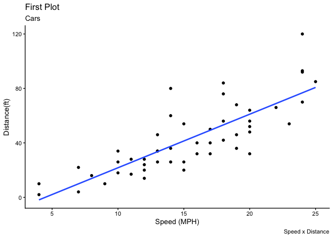
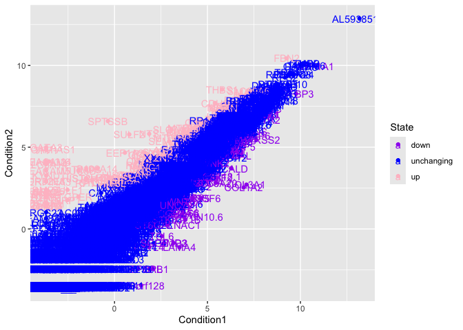
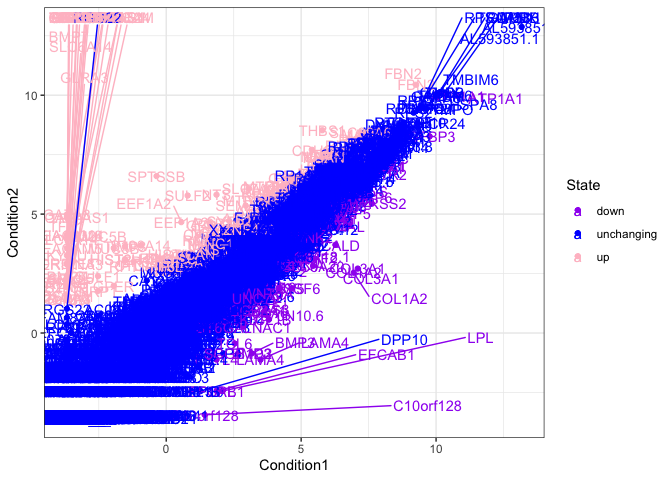
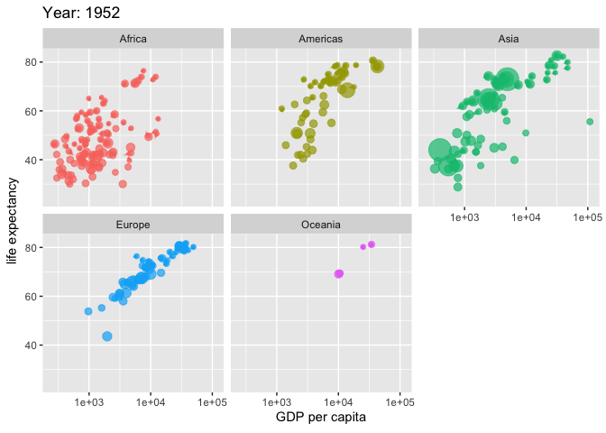

# Class05: Data Viz with GGPLOT
Alexandra Garcia (PID: A16278166)

Today we are playing with plotting and graphics in R.

There are lots of ways to make cool figures in R. There is “base” R
graphics (`plot()`, `hist()`, `boxplot()` etc.)

There is also add-on packages, like **ggplot**.

``` r
head(cars, 3)
```

      speed dist
    1     4    2
    2     4   10
    3     7    4

Let’s plot this with “base” R:

``` r
plot(cars)
```


``` r
head(mtcars)
```

                       mpg cyl disp  hp drat    wt  qsec vs am gear carb
    Mazda RX4         21.0   6  160 110 3.90 2.620 16.46  0  1    4    4
    Mazda RX4 Wag     21.0   6  160 110 3.90 2.875 17.02  0  1    4    4
    Datsun 710        22.8   4  108  93 3.85 2.320 18.61  1  1    4    1
    Hornet 4 Drive    21.4   6  258 110 3.08 3.215 19.44  1  0    3    1
    Hornet Sportabout 18.7   8  360 175 3.15 3.440 17.02  0  0    3    2
    Valiant           18.1   6  225 105 2.76 3.460 20.22  1  0    3    1

Let’s plot `mpg` vs `disp`

``` r
plot(mtcars$mpg, mtcars$disp, pch=16)
```


``` r
hist(mtcars$mpg)
```


## GGPLOT

The main function of GGPLOT2 package is `ggplot()`. First I need to
install the **ggplot2** package. I can install any package with the
function `install.package()`. You want to install this in console
because you only need to install it once.

> **N.B.** I never want to run `install.packages()` in my quarto source
> document!!! Otherwise, you will be installing package every time you
> are running “render”.

Every time you use one of these add on packages, you have to load it in.

> **N.B.** You want to load the function before you use it. Run
> `library()`

``` r
library(ggplot2)
ggplot(cars) + 
  aes(x=speed, y=dist) + 
  geom_point()
```


``` r
ggplot(cars) + 
  aes(speed) + 
  geom_histogram()
```

    `stat_bin()` using `bins = 30`. Pick better value `binwidth`.


Every ggplot needs at least 3 things.

- The **data** (given with `ggplot(cars)`)
- The **aesthetic** mapping (given with `aes()`)
- The **geom** (given with `geom_point()`)

> For simple canned graphs “base” R is always faster

### Adding more layers

Let’s add a line

``` r
library(ggplot2)
ggplot(cars) + 
  aes(x=speed, y=dist) + 
  geom_point() +
  geom_line()
```


``` r
library(ggplot2)
ggplot(cars) + 
  aes(x=speed, y=dist) + 
  geom_point() +
  geom_smooth()
```

    `geom_smooth()` using method = 'loess' and formula = 'y ~ x'


``` r
library(ggplot2)
ggplot(cars) + 
  aes(x=speed, y=dist) + 
  geom_point() +
  geom_smooth(method = 'lm', se=FALSE)
```

    `geom_smooth()` using formula = 'y ~ x'


### Adding more layers

Let’s add a line and a title, subtitle, and caption as well as custom
axis labels

``` r
library(ggplot2)
ggplot(cars) + 
  aes(x=speed, y=dist) + 
  geom_point() +
  geom_smooth(method = 'lm', se=FALSE) + 
  labs(title = "First Plot", 
       subtitle = "Cars", 
       caption = "Speed x Distance", 
       x = "Speed (MPH)", 
       y = "Distance(ft)") +
  theme_classic()
```

    `geom_smooth()` using formula = 'y ~ x'



## Plot some expression data

Read data file from online URL

``` r
url <- "https://bioboot.github.io/bimm143_S20/class-material/up_down_expression.txt"
genes <- read.delim(url)
head(genes)
```

            Gene Condition1 Condition2      State
    1      A4GNT -3.6808610 -3.4401355 unchanging
    2       AAAS  4.5479580  4.3864126 unchanging
    3      AASDH  3.7190695  3.4787276 unchanging
    4       AATF  5.0784720  5.0151916 unchanging
    5       AATK  0.4711421  0.5598642 unchanging
    6 AB015752.4 -3.6808610 -3.5921390 unchanging

> Q1 How many genes are in this dataset?

There are 5196 in this dataset

> Q2. How many ‘up’ regulated genes are there?

``` r
sum(genes$State == "up")
```

    [1] 127

``` r
table(genes$State)
```


          down unchanging         up 
            72       4997        127 

Basic scatter plot

``` r
ggplot(genes) + 
    aes(x=Condition1, y=Condition2) +
    geom_point()
```


Color by State

``` r
ggplot(genes) + 
    aes(x=Condition1, y=Condition2, col=State) +
    geom_point()
```


What if you want to change the color palette?

``` r
p <- ggplot(genes) + 
    aes(x=Condition1, y=Condition2, col=State) +
    geom_point() +
    scale_color_manual(values=c("purple", "blue", "pink"))
```

What if I want to label every point (every gene)?

``` r
ggplot(genes) + 
    aes(x=Condition1, 
        y=Condition2, 
        col=State, 
        label=Gene) +
    geom_point() +
    scale_color_manual(values=c("purple", "blue", "pink")) +
    geom_text()
```



This makes the plot look silly because it adds a label onto every
coordinate point, which makes it hard to read.

> Install `ggrepel` package in console and load it in using `library()`

``` r
library(ggrepel)

ggplot(genes) + 
    aes(x=Condition1, 
        y=Condition2, 
        col=State, 
        label=Gene) +
    geom_point() +
    scale_color_manual(values=c("purple", "blue", "pink")) +
    geom_text() +
    geom_text_repel(max.overlaps = 60) + 
    theme_bw()
```

    Warning: ggrepel: 5150 unlabeled data points (too many overlaps). Consider
    increasing max.overlaps



## Going further

Playing with more layers using gapminder dataset

``` r
url <- "https://raw.githubusercontent.com/jennybc/gapminder/master/inst/extdata/gapminder.tsv"

gapminder <- read.delim(url)
```

``` r
head(gapminder)
```

          country continent year lifeExp      pop gdpPercap
    1 Afghanistan      Asia 1952  28.801  8425333  779.4453
    2 Afghanistan      Asia 1957  30.332  9240934  820.8530
    3 Afghanistan      Asia 1962  31.997 10267083  853.1007
    4 Afghanistan      Asia 1967  34.020 11537966  836.1971
    5 Afghanistan      Asia 1972  36.088 13079460  739.9811
    6 Afghanistan      Asia 1977  38.438 14880372  786.1134

``` r
tail(gapminder)
```

          country continent year lifeExp      pop gdpPercap
    1699 Zimbabwe    Africa 1982  60.363  7636524  788.8550
    1700 Zimbabwe    Africa 1987  62.351  9216418  706.1573
    1701 Zimbabwe    Africa 1992  60.377 10704340  693.4208
    1702 Zimbabwe    Africa 1997  46.809 11404948  792.4500
    1703 Zimbabwe    Africa 2002  39.989 11926563  672.0386
    1704 Zimbabwe    Africa 2007  43.487 12311143  469.7093

Make a plot of gdp per year (x) and gdp per cap (y)

``` r
ggplot(gapminder) +
  aes(x=gdpPercap, y=lifeExp) +
  geom_point()
```


Color it by continent

``` r
ggplot(gapminder) +
  aes(x=gdpPercap, y=lifeExp, col=continent) +
  geom_point()
```


Divide it into different panels per continent

``` r
ggplot(gapminder) +
  aes(x=gdpPercap, y=lifeExp, col=continent) +
  geom_point() +
  facet_wrap(~continent)
```


## Make a more interesting plot

I will be using animation

> In console, install `gifski` and `gganimate`

``` r
library(gganimate)

ggplot(gapminder) + 
  aes(x=gdpPercap, y=lifeExp, size = pop, color = continent) +
  geom_point(alpha = 0.7, show.legend = FALSE) +
  scale_size(range = c(2, 12)) +
  scale_x_log10() +
  facet_wrap(~continent) +
  labs(title = 'Year: {frame_time}', x = 'GDP per capita', y = 'life expectancy') +
  transition_time(year) +
  shadow_wake(wake_length = 0.1, alpha = FALSE)
```


