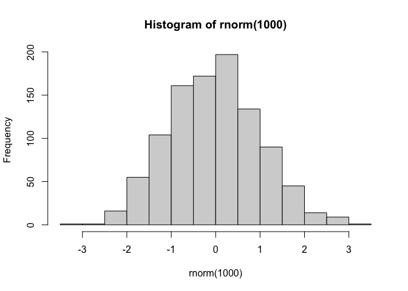
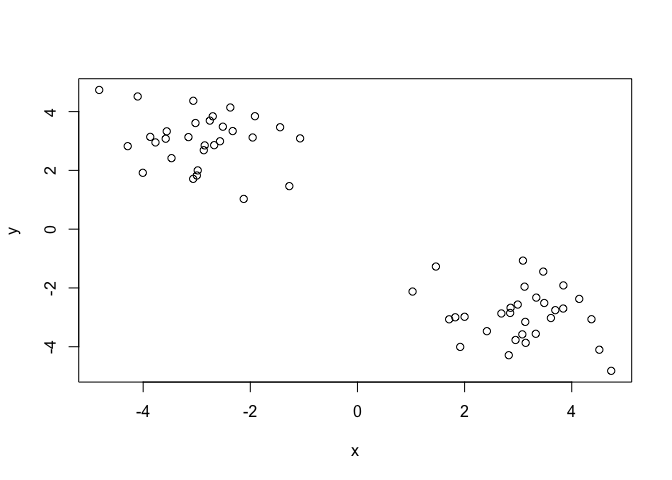
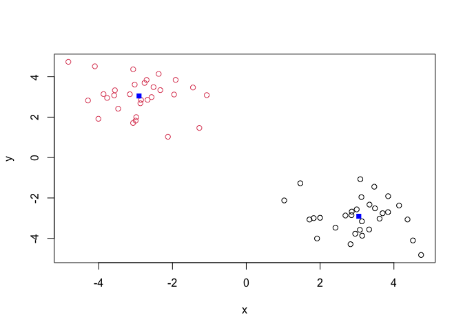
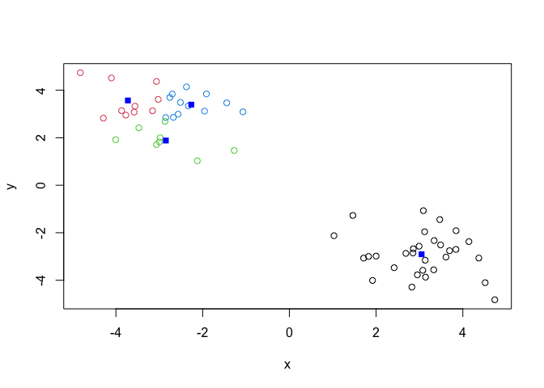
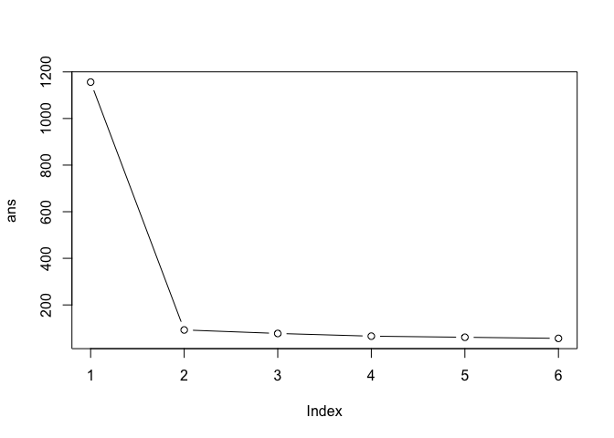
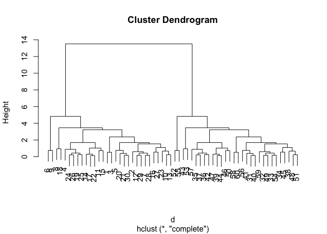
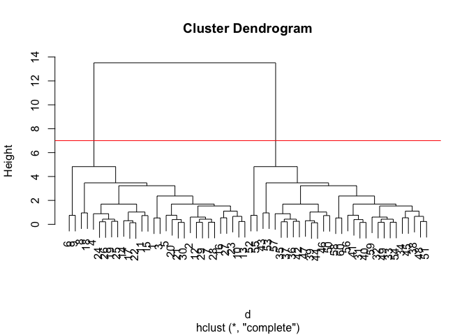
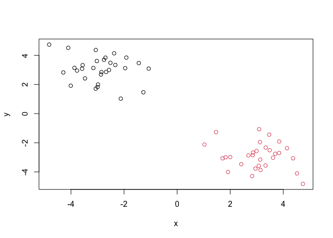

# Class 7: Machine Learning 1
Alexandra Garcia (A16278166)

Today we will begin our exploration of some “classical” machine learning
approaches. We will start with clustering.

Lets first make up some data cluster where we know what the answer
should be.

``` r
hist(rnorm(1000))
```



Make a vector with two groups of 30 random numbers centered around -3
and 3 on both the x and y axis

> The function `rev()` reverses the vector order The function `cbind()`
> binds the values by column

``` r
x <- c(rnorm(30, mean=-3), rnorm(30, mean=3))
y <- rev(x)

x <- cbind(x,y)

head(x)
```

                 x        y
    [1,] -1.070470 3.089402
    [2,] -3.155027 3.132475
    [3,] -1.444130 3.468394
    [4,] -4.288396 2.824984
    [5,] -3.064426 4.368472
    [6,] -4.820947 4.736846

``` r
plot(x)
```



The main function in “base” R for k-means clustering is called
`kmeans()`.

> The “clustering vector” in the result tells you which cluster each
> number belongs to.

``` r
k <- kmeans(x, centers = 2)

k
```

    K-means clustering with 2 clusters of sizes 30, 30

    Cluster means:
              x         y
    1  3.048628 -2.905677
    2 -2.905677  3.048628

    Clustering vector:
     [1] 2 2 2 2 2 2 2 2 2 2 2 2 2 2 2 2 2 2 2 2 2 2 2 2 2 2 2 2 2 2 1 1 1 1 1 1 1 1
    [39] 1 1 1 1 1 1 1 1 1 1 1 1 1 1 1 1 1 1 1 1 1 1

    Within cluster sum of squares by cluster:
    [1] 46.32337 46.32337
     (between_SS / total_SS =  92.0 %)

    Available components:

    [1] "cluster"      "centers"      "totss"        "withinss"     "tot.withinss"
    [6] "betweenss"    "size"         "iter"         "ifault"      

> Q. How big are the clusters (their size)?

``` r
k$size
```

    [1] 30 30

> Q. What clusters do my data points reside in?

``` r
k$cluster
```

     [1] 2 2 2 2 2 2 2 2 2 2 2 2 2 2 2 2 2 2 2 2 2 2 2 2 2 2 2 2 2 2 1 1 1 1 1 1 1 1
    [39] 1 1 1 1 1 1 1 1 1 1 1 1 1 1 1 1 1 1 1 1 1 1

> Q. Make a plot of our data colored by cluster assignment

``` r
plot(x, col=k$cluster)
points(k$centers, col="blue", pch=15)
```



> Q. Cluster with k-means into 4 clusters and plot your results

``` r
k4 <- kmeans(x, centers = 4)

plot(x, col=k4$cluster)
points(k4$centers, col="blue", pch=15)
```



> Q. Run kmeans with centers equal to 1:6. Store the within cluster sum
> square.

``` r
ans <- NULL

for (i in 1:6) {
  ans <- c(ans, kmeans(x, centers = i)$tot.withinss)
}
ans
```

    [1] 1156.25921   92.64674   77.54685   65.92775   61.22927   56.39245

Make a plot

``` r
plot(ans, type="b")
```



## Hierarchical Clustering

The main function in “base” R for this is called `hclust()`

``` r
d <- dist(x)

hc <- hclust(d)

hc
```


    Call:
    hclust(d = d)

    Cluster method   : complete 
    Distance         : euclidean 
    Number of objects: 60 

``` r
plot(hc)
```



``` r
plot(hc)
abline(h=7, col="red")
```



To obrtain clusters from our `hclust()` result object, **hc** we “cut”
the tree. Use the `cutree()` function

``` r
grps <- cutree(hc, h=7)
grps
```

     [1] 1 1 1 1 1 1 1 1 1 1 1 1 1 1 1 1 1 1 1 1 1 1 1 1 1 1 1 1 1 1 2 2 2 2 2 2 2 2
    [39] 2 2 2 2 2 2 2 2 2 2 2 2 2 2 2 2 2 2 2 2 2 2

``` r
plot(x, col=grps)
```



``` r
library(pheatmap)

pheatmap(x)
```


## Principal Component Analysis (PCA)

``` r
url <- "https://tinyurl.com/UK-foods"
x <- read.csv(url)
```

> Q1. How many rows and columns are in your new data frame named x? What
> R functions could you use to answer this questions?

``` r
dim(x)
```

    [1] 17  5

``` r
nrow(x)
```

    [1] 17

``` r
ncol(x)
```

    [1] 5

There are 17 rows and 5 columns in x.

## Preview the first 6 rows

``` r
head(x, 6)
```

                   X England Wales Scotland N.Ireland
    1         Cheese     105   103      103        66
    2  Carcass_meat      245   227      242       267
    3    Other_meat      685   803      750       586
    4           Fish     147   160      122        93
    5 Fats_and_oils      193   235      184       209
    6         Sugars     156   175      147       139

``` r
x <- read.csv(url, row.names=1)
head(x)
```

                   England Wales Scotland N.Ireland
    Cheese             105   103      103        66
    Carcass_meat       245   227      242       267
    Other_meat         685   803      750       586
    Fish               147   160      122        93
    Fats_and_oils      193   235      184       209
    Sugars             156   175      147       139

> Q2. Which approach to solving the ‘row-names problem’ mentioned above
> do you prefer and why? Is one approach more robust than another under
> certain circumstances?

I prefer the second approach (using row.names) because the first
approach causes x to be over written every time, meaning you lose data
every time you run the code.

``` r
barplot(as.matrix(x), beside=T, col=rainbow(nrow(x)))
```


> Q3: Changing what optional argument in the above barplot() function
> results in the following plot?

``` r
barplot(as.matrix(x), beside=F, col=rainbow(nrow(x)))
```


Change beside to F.

``` r
library(tidyr)

# Convert data to long format for ggplot with `pivot_longer()`
x_long <- x |> 
          tibble::rownames_to_column("Food") |> 
          pivot_longer(cols = -Food, 
                       names_to = "Country", 
                       values_to = "Consumption")

dim(x_long)
```

    [1] 68  3

``` r
library(ggplot2)

ggplot(x_long) +
  aes(x = Country, y = Consumption, fill = Food) +
  geom_col(position = "dodge") +
  theme_bw()
```


> Q4: Changing what optional argument in the above ggplot() code results
> in a stacked barplot figure?

``` r
ggplot(x_long) +
  aes(x = Country, y = Consumption, fill = Food) +
  geom_col(position = "stack") +
  theme_bw()
```


> Q5: We can use the pairs() function to generate all pairwise plots for
> our countries. Can you make sense of the following code and resulting
> figure? What does it mean if a given point lies on the diagonal for a
> given plot?

``` r
pairs(x, col=rainbow(nrow(x)), pch=16)
```


The points are different foods. The diagonal lines means there are
similar numbers of foods across the countries compared to each other.

``` r
library(pheatmap)

pheatmap( as.matrix(x) )
```


> Q6. Based on the pairs and heatmap figures, which countries cluster
> together and what does this suggest about their food consumption
> patterns? Can you easily tell what the main differences between N.
> Ireland and the other countries of the UK in terms of this data-set?

Based on the pairs, the countries that cluster together are England and
Wales. This suggests that they are consuming the same things. It is
still hard to tell the differences between N.Ireland and other
countries.

## PCA to the rescue

As we want to do PCA on the food data for the different countries we
will want the foods in the columns. I want to transpose the data (change
the structure) because I want the foods in the columns.

``` r
# Use the prcomp() PCA function 
pca <- prcomp( t(x) )
summary(pca)
```

    Importance of components:
                                PC1      PC2      PC3       PC4
    Standard deviation     324.1502 212.7478 73.87622 2.921e-14
    Proportion of Variance   0.6744   0.2905  0.03503 0.000e+00
    Cumulative Proportion    0.6744   0.9650  1.00000 1.000e+00

Our result object is called `pca()` and it has a `$x` component that we
will look at.

``` r
pca$x
```

                     PC1         PC2        PC3           PC4
    England   -144.99315   -2.532999 105.768945 -9.152022e-15
    Wales     -240.52915 -224.646925 -56.475555  5.560040e-13
    Scotland   -91.86934  286.081786 -44.415495 -6.638419e-13
    N.Ireland  477.39164  -58.901862  -4.877895  1.329771e-13

> Q7. Complete the code below to generate a plot of PC1 vs PC2. The
> second line adds text labels over the data points.

``` r
# Create a data frame for plotting
df <- as.data.frame(pca$x)
df$Country <- rownames(df)

# Plot PC1 vs PC2 with ggplot
ggplot(pca$x) +
  aes(x = PC1, y = PC2, label = rownames(pca$x)) +
  geom_point(size = 3) +
  geom_text(vjust = -0.5) +
  xlim(-270, 500) +
  xlab("PC1") +
  ylab("PC2") +
  theme_bw()
```


> Q8. Customize your plot so that the colors of the country names match
> the colors in our UK and Ireland map and table at start of this
> document.

``` r
cols <- c("orange", "red", "blue", "darkgreen")

ggplot(pca$x) +
  aes(x = PC1, y = PC2, label = rownames(pca$x)) +
  geom_point(size = 3, col=cols) +
  geom_text(vjust = -0.5, col=cols) +
  xlim(-270, 500) +
  xlab("PC1") +
  ylab("PC2") +
  theme_bw()
```


Another major result of PCA is the so-called “loadingS” or `$rotation`
and that tells us how the original variables (foods) contribute to the
new PCs (our new axis).

``` r
pca$rotation
```

                                 PC1          PC2         PC3          PC4
    Cheese              -0.056955380  0.016012850  0.02394295 -0.409382587
    Carcass_meat         0.047927628  0.013915823  0.06367111  0.729481922
    Other_meat          -0.258916658 -0.015331138 -0.55384854  0.331001134
    Fish                -0.084414983 -0.050754947  0.03906481  0.022375878
    Fats_and_oils       -0.005193623 -0.095388656 -0.12522257  0.034512161
    Sugars              -0.037620983 -0.043021699 -0.03605745  0.024943337
    Fresh_potatoes       0.401402060 -0.715017078 -0.20668248  0.021396007
    Fresh_Veg           -0.151849942 -0.144900268  0.21382237  0.001606882
    Other_Veg           -0.243593729 -0.225450923 -0.05332841  0.031153231
    Processed_potatoes  -0.026886233  0.042850761 -0.07364902 -0.017379680
    Processed_Veg       -0.036488269 -0.045451802  0.05289191  0.021250980
    Fresh_fruit         -0.632640898 -0.177740743  0.40012865  0.227657348
    Cereals             -0.047702858 -0.212599678 -0.35884921  0.100043319
    Beverages           -0.026187756 -0.030560542 -0.04135860 -0.018382072
    Soft_drinks          0.232244140  0.555124311 -0.16942648  0.222319484
    Alcoholic_drinks    -0.463968168  0.113536523 -0.49858320 -0.273126013
    Confectionery       -0.029650201  0.005949921 -0.05232164  0.001890737

``` r
## Lets focus on PC1 as it accounts for > 90% of variance 
ggplot(pca$rotation) +
  aes(x = PC1, 
      y = reorder(rownames(pca$rotation), PC1)) +
  geom_col(fill = "steelblue") +
  xlab("PC1 Loading Score") +
  ylab("") +
  theme_bw() +
  theme(axis.text.y = element_text(size = 9))
```


> Q9: Generate a similar ‘loadings plot’ for PC2. What two food groups
> feature prominantely and what does PC2 maninly tell us about?

``` r
ggplot(pca$rotation) +
  aes(x = PC2, 
      y = reorder(rownames(pca$rotation), PC2)) +
  geom_col(fill = "steelblue") +
  xlab("PC2 Loading Score") +
  ylab("") +
  theme_bw() +
  theme(axis.text.y = element_text(size = 9))
```


The two main food groups that are prominent are soft drinks and
alcoholic drinks. PC2 mainly tells us that the countries that are above
0, which is Scotland on the PC2 axis in the graph above, consume more of
these drinks than

## PCA of RNA-seq data

``` r
url2 <- "https://tinyurl.com/expression-CSV"
rna.data <- read.csv(url2, row.names=1)
head(rna.data)
```

           wt1 wt2  wt3  wt4 wt5 ko1 ko2 ko3 ko4 ko5
    gene1  439 458  408  429 420  90  88  86  90  93
    gene2  219 200  204  210 187 427 423 434 433 426
    gene3 1006 989 1030 1017 973 252 237 238 226 210
    gene4  783 792  829  856 760 849 856 835 885 894
    gene5  181 249  204  244 225 277 305 272 270 279
    gene6  460 502  491  491 493 612 594 577 618 638

> Q10: How many genes and samples are in this data set? How many PCs do
> you think it will take to have a useful overview of this data set (see
> below)?

``` r
nrow(rna.data)
```

    [1] 100

``` r
ncol(rna.data)
```

    [1] 10

There are 100 genes and 10 samples.

``` r
## Again we have to take the transpose of our data 
pca <- prcomp(t(rna.data), scale=TRUE)

# Create data frame for plotting
df <- as.data.frame(pca$x)
df$Sample <- rownames(df)

library(ggplot2)

## Plot with ggplot
ggplot(df) +
  aes(x = PC1, y = PC2, label = Sample) +
  geom_point(size = 3) +
  geom_text(vjust = -0.5, size = 3) +
  xlab("PC1") +
  ylab("PC2") +
  theme_bw()
```


``` r
summary(pca)
```

    Importance of components:
                              PC1    PC2     PC3     PC4     PC5     PC6     PC7
    Standard deviation     9.6237 1.5198 1.05787 1.05203 0.88062 0.82545 0.80111
    Proportion of Variance 0.9262 0.0231 0.01119 0.01107 0.00775 0.00681 0.00642
    Cumulative Proportion  0.9262 0.9493 0.96045 0.97152 0.97928 0.98609 0.99251
                               PC8     PC9    PC10
    Standard deviation     0.62065 0.60342 3.3e-15
    Proportion of Variance 0.00385 0.00364 0.0e+00
    Cumulative Proportion  0.99636 1.00000 1.0e+00

Based on the summary PCA results, we will only have to run 1 PC to have
a useful overview of this dataset because PC1 has 92.6% of the
cumulative proportion of variance, meaning that it captures a large
amount of the principal features of the original data.
