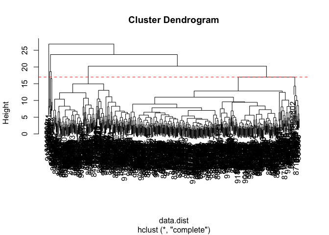

# Class 08: Mini Project
Alexandra Garcia (A16278166)

- [Background](#background)
- [Data import](#data-import)
- [Principal Component Analysis](#principal-component-analysis)
- [Hierarchical clustering](#hierarchical-clustering)

## Background

The goal of this mini-project is for us to explore a complete analysis
using the unsupervised learning techniques covered in class. I’ll extend
what I’ve learned by combining PCA as a preprocessing step to clustering
using data that consist of measurements of cell nuclei of human breast
masses.

The data itself comes from the Wisconsin Breast Cancer Diagnostic Data
Set first reported by K. P. Benne and O. L. Mangasarian: “Robust Linear
Programming Discrimination of Two Linearly Inseparable Sets”.

Values in this data set describe characteristics of the cell nuclei
present in digitized images of a fine needle aspiration (FNA) of a
breast mass.

## Data import

``` r
wisc.df <- read.csv("WisconsinCancer.csv", row.names = 1)
```

Make sure we do not include sample id or the diagnosis column in further
analysis because you don’t want personal patient information to be
included in analysis.

``` r
diagnosis <- as.factor(wisc.df$diagnosis)

wisc.data <- wisc.df[, -1]

dim(wisc.data)
```

    [1] 569  30

``` r
head(wisc.data)
```

             radius_mean texture_mean perimeter_mean area_mean smoothness_mean
    842302         17.99        10.38         122.80    1001.0         0.11840
    842517         20.57        17.77         132.90    1326.0         0.08474
    84300903       19.69        21.25         130.00    1203.0         0.10960
    84348301       11.42        20.38          77.58     386.1         0.14250
    84358402       20.29        14.34         135.10    1297.0         0.10030
    843786         12.45        15.70          82.57     477.1         0.12780
             compactness_mean concavity_mean concave.points_mean symmetry_mean
    842302            0.27760         0.3001             0.14710        0.2419
    842517            0.07864         0.0869             0.07017        0.1812
    84300903          0.15990         0.1974             0.12790        0.2069
    84348301          0.28390         0.2414             0.10520        0.2597
    84358402          0.13280         0.1980             0.10430        0.1809
    843786            0.17000         0.1578             0.08089        0.2087
             fractal_dimension_mean radius_se texture_se perimeter_se area_se
    842302                  0.07871    1.0950     0.9053        8.589  153.40
    842517                  0.05667    0.5435     0.7339        3.398   74.08
    84300903                0.05999    0.7456     0.7869        4.585   94.03
    84348301                0.09744    0.4956     1.1560        3.445   27.23
    84358402                0.05883    0.7572     0.7813        5.438   94.44
    843786                  0.07613    0.3345     0.8902        2.217   27.19
             smoothness_se compactness_se concavity_se concave.points_se
    842302        0.006399        0.04904      0.05373           0.01587
    842517        0.005225        0.01308      0.01860           0.01340
    84300903      0.006150        0.04006      0.03832           0.02058
    84348301      0.009110        0.07458      0.05661           0.01867
    84358402      0.011490        0.02461      0.05688           0.01885
    843786        0.007510        0.03345      0.03672           0.01137
             symmetry_se fractal_dimension_se radius_worst texture_worst
    842302       0.03003             0.006193        25.38         17.33
    842517       0.01389             0.003532        24.99         23.41
    84300903     0.02250             0.004571        23.57         25.53
    84348301     0.05963             0.009208        14.91         26.50
    84358402     0.01756             0.005115        22.54         16.67
    843786       0.02165             0.005082        15.47         23.75
             perimeter_worst area_worst smoothness_worst compactness_worst
    842302            184.60     2019.0           0.1622            0.6656
    842517            158.80     1956.0           0.1238            0.1866
    84300903          152.50     1709.0           0.1444            0.4245
    84348301           98.87      567.7           0.2098            0.8663
    84358402          152.20     1575.0           0.1374            0.2050
    843786            103.40      741.6           0.1791            0.5249
             concavity_worst concave.points_worst symmetry_worst
    842302            0.7119               0.2654         0.4601
    842517            0.2416               0.1860         0.2750
    84300903          0.4504               0.2430         0.3613
    84348301          0.6869               0.2575         0.6638
    84358402          0.4000               0.1625         0.2364
    843786            0.5355               0.1741         0.3985
             fractal_dimension_worst
    842302                   0.11890
    842517                   0.08902
    84300903                 0.08758
    84348301                 0.17300
    84358402                 0.07678
    843786                   0.12440

> Q1. How many observations are in this dataset?

``` r
dim(wisc.data)
```

    [1] 569  30

There are 569 patients.

> Q2. How many of the observations have a malignant diagnosis?

``` r
# you can use table function
table(diagnosis)
```

    diagnosis
      B   M 
    357 212 

``` r
# or you can use sum
sum(diagnosis == "M")
```

    [1] 212

There are 212 malignant diagnosis.

> Q3. How many variables/features in the data are suffixed with \_mean?

``` r
length(grep("_mean", colnames(wisc.data)))
```

    [1] 10

There are 10 columns titled with \_mean.

## Principal Component Analysis

The main function in base R for PCA is called `prcomp()`. A optiional
argument `scale` should nearly always be switched to `scale=TRUE` for
this function.

``` r
# Check column means and standard deviations
colMeans(wisc.data)
```

                radius_mean            texture_mean          perimeter_mean 
               1.412729e+01            1.928965e+01            9.196903e+01 
                  area_mean         smoothness_mean        compactness_mean 
               6.548891e+02            9.636028e-02            1.043410e-01 
             concavity_mean     concave.points_mean           symmetry_mean 
               8.879932e-02            4.891915e-02            1.811619e-01 
     fractal_dimension_mean               radius_se              texture_se 
               6.279761e-02            4.051721e-01            1.216853e+00 
               perimeter_se                 area_se           smoothness_se 
               2.866059e+00            4.033708e+01            7.040979e-03 
             compactness_se            concavity_se       concave.points_se 
               2.547814e-02            3.189372e-02            1.179614e-02 
                symmetry_se    fractal_dimension_se            radius_worst 
               2.054230e-02            3.794904e-03            1.626919e+01 
              texture_worst         perimeter_worst              area_worst 
               2.567722e+01            1.072612e+02            8.805831e+02 
           smoothness_worst       compactness_worst         concavity_worst 
               1.323686e-01            2.542650e-01            2.721885e-01 
       concave.points_worst          symmetry_worst fractal_dimension_worst 
               1.146062e-01            2.900756e-01            8.394582e-02 

``` r
apply(wisc.data,2,sd)
```

                radius_mean            texture_mean          perimeter_mean 
               3.524049e+00            4.301036e+00            2.429898e+01 
                  area_mean         smoothness_mean        compactness_mean 
               3.519141e+02            1.406413e-02            5.281276e-02 
             concavity_mean     concave.points_mean           symmetry_mean 
               7.971981e-02            3.880284e-02            2.741428e-02 
     fractal_dimension_mean               radius_se              texture_se 
               7.060363e-03            2.773127e-01            5.516484e-01 
               perimeter_se                 area_se           smoothness_se 
               2.021855e+00            4.549101e+01            3.002518e-03 
             compactness_se            concavity_se       concave.points_se 
               1.790818e-02            3.018606e-02            6.170285e-03 
                symmetry_se    fractal_dimension_se            radius_worst 
               8.266372e-03            2.646071e-03            4.833242e+00 
              texture_worst         perimeter_worst              area_worst 
               6.146258e+00            3.360254e+01            5.693570e+02 
           smoothness_worst       compactness_worst         concavity_worst 
               2.283243e-02            1.573365e-01            2.086243e-01 
       concave.points_worst          symmetry_worst fractal_dimension_worst 
               6.573234e-02            6.186747e-02            1.806127e-02 

``` r
# Perform PCA on wisc.data. You want to always scale the data to make sure that every column in your analysis is contributing equally. 
wisc.pr <- prcomp(wisc.data, scale=TRUE)
```

``` r
# Look at summary of results
summary(wisc.pr)
```

    Importance of components:
                              PC1    PC2     PC3     PC4     PC5     PC6     PC7
    Standard deviation     3.6444 2.3857 1.67867 1.40735 1.28403 1.09880 0.82172
    Proportion of Variance 0.4427 0.1897 0.09393 0.06602 0.05496 0.04025 0.02251
    Cumulative Proportion  0.4427 0.6324 0.72636 0.79239 0.84734 0.88759 0.91010
                               PC8    PC9    PC10   PC11    PC12    PC13    PC14
    Standard deviation     0.69037 0.6457 0.59219 0.5421 0.51104 0.49128 0.39624
    Proportion of Variance 0.01589 0.0139 0.01169 0.0098 0.00871 0.00805 0.00523
    Cumulative Proportion  0.92598 0.9399 0.95157 0.9614 0.97007 0.97812 0.98335
                              PC15    PC16    PC17    PC18    PC19    PC20   PC21
    Standard deviation     0.30681 0.28260 0.24372 0.22939 0.22244 0.17652 0.1731
    Proportion of Variance 0.00314 0.00266 0.00198 0.00175 0.00165 0.00104 0.0010
    Cumulative Proportion  0.98649 0.98915 0.99113 0.99288 0.99453 0.99557 0.9966
                              PC22    PC23   PC24    PC25    PC26    PC27    PC28
    Standard deviation     0.16565 0.15602 0.1344 0.12442 0.09043 0.08307 0.03987
    Proportion of Variance 0.00091 0.00081 0.0006 0.00052 0.00027 0.00023 0.00005
    Cumulative Proportion  0.99749 0.99830 0.9989 0.99942 0.99969 0.99992 0.99997
                              PC29    PC30
    Standard deviation     0.02736 0.01153
    Proportion of Variance 0.00002 0.00000
    Cumulative Proportion  1.00000 1.00000

> Q4. From your results, what proportion of the original variance is
> captured by the first principal components (PC1)?

44.27%

> Q5. How many principal components (PCs) are required to describe at
> least 70% of the original variance in the data?

PC3

> Q6. How many principal components (PCs) are required to describe at
> least 90% of the original variance in the data?

PC7

Let’s make our main results figure - the “PC plot” or “score plot” or
“ordienation” etc.

``` r
library(ggplot2)

ggplot(wisc.pr$x) +
  aes(PC1, PC2, col=diagnosis) +
  geom_point()
```


> Q7. What stands out to you about this plot? Is it easy or difficult to
> understand? Why?

This plot shows that there is a clear separation between B and M
diagnoses, meaning there is something going on somewhere in the data
that is determining the diagnosis.

> Q8. Generate a similar plot for principal components 1 and 3. What do
> you notice about these plots?

``` r
ggplot(wisc.pr$x) +
  aes(PC1, PC3, col=diagnosis) +
  geom_point()
```


The values are set lower on the y axis on PC3 but there is still a clear
separation between B and M diagnosis.

``` r
# Calculate variance of each component
pr.var <- wisc.pr$sdev^2
head(pr.var)
```

    [1] 13.281608  5.691355  2.817949  1.980640  1.648731  1.207357

``` r
# Variance explained by each principal component: pve
pve <- pr.var / sum(pr.var)
```

``` r
plot(pve, xlab = "Principal Component", 
     ylab = "Proportion of Variance Explained", 
     ylim = c(0, 1), type = "o")
```


> Q9. For the first principal component, what is the component of the
> loading vector (i.e. wisc.pr\$rotation\[,1\]) for the feature
> concave.points_mean? This tells us how much this original feature
> contributes to the first PC.

``` r
wisc.pr$rotation["concave.points_mean", 1]
```

    [1] -0.2608538

The concave.points_mean feature of the tumor features is highly
contributing to the malignancy of a tumor because if we look at the PCA
plot above of PC1 (x axis), the value -0.26 is going left of the 0 point
on the axis, where all the malignant diagnoses are placed.

## Hierarchical clustering

``` r
# Scale the wisc.data data using the "scale()" function
data.scaled <- scale(wisc.data)

data.dist <- dist(data.scaled)

wisc.hclust <- hclust(data.dist, method="complete")
```

> Q10. Using the plot() and abline() functions, what is the height at
> which the clustering model has 4 clusters?

``` r
plot(wisc.hclust)
abline(h=17, col="red", lty=2)
```



Height 17 has 4 clusters.

``` r
wisc.hclust.clusters <- cutree(wisc.hclust, 4)

table(wisc.hclust.clusters, diagnosis)
```

                        diagnosis
    wisc.hclust.clusters   B   M
                       1  12 165
                       2   2   5
                       3 343  40
                       4   0   2

> Q12. Which method gives your favorite results for the same data.dist
> dataset? Explain your reasoning.

``` r
wisc.hclust.sing <- hclust(data.dist, method="sing")
plot(wisc.hclust.sing)
```


``` r
wisc.hclust.avg <- hclust(data.dist, method="average")
plot(wisc.hclust.avg)
```


``` r
wisc.hclust.ward <- hclust(data.dist, method="ward.D2")
plot(wisc.hclust.ward)
```


My favorite method is ward.D2 because it allows for a nicer display of
the clustering that is not as crowded at the top.

``` r
wisc.pr.hclust <- hclust(data.dist, method="ward.D2")

grps <- cutree(wisc.pr.hclust, k=2)
table(grps)
```

    grps
      1   2 
    184 385 

``` r
table(grps, diagnosis)
```

        diagnosis
    grps   B   M
       1  20 164
       2 337  48

``` r
plot(wisc.pr$x[,1:2], col=grps)
```


``` r
plot(wisc.pr$x[,1:2], col=diagnosis)
```


``` r
g <- as.factor(grps)
levels(g)
```

    [1] "1" "2"

``` r
g <- relevel(g,2)
levels(g)
```

    [1] "2" "1"

``` r
# Plot using our re-ordered factor 
plot(wisc.pr$x[,1:2], col=g)
```


``` r
wisc.pr.hclust <- hclust(dist(wisc.pr$x[, 1:7]), method="ward.D2")

wisc.pr.hclust.clusters <- cutree(wisc.pr.hclust, k=2)
```

> Q13. How well does the newly created model with four clusters separate
> out the two diagnoses?

``` r
table(wisc.pr.hclust.clusters, diagnosis)
```

                           diagnosis
    wisc.pr.hclust.clusters   B   M
                          1  28 188
                          2 329  24

I think that the new model with 4 clusters separates out the data even
more, which is better.

> Q14. How well do the hierarchical clustering models you created in
> previous sections (i.e. before PCA) do in terms of separating the
> diagnoses? Again, use the table() function to compare the output of
> each model (wisc.km\$cluster and wisc.hclust.clusters) with the vector
> containing the actual diagnoses.

``` r
table(wisc.hclust.clusters, diagnosis)
```

                        diagnosis
    wisc.hclust.clusters   B   M
                       1  12 165
                       2   2   5
                       3 343  40
                       4   0   2

This model is better for separating out the diagnosis because it can
allows you to check out the true and false positives in each diagnosis
group.
